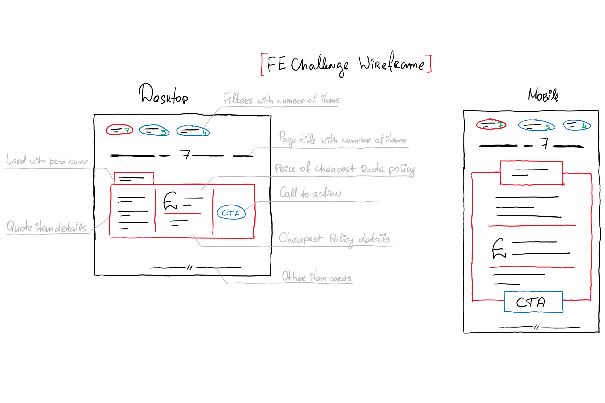

# GoCompare Front End Coding Challenge

### Wireframe

## Decisions
- For speed I've setup the project using Create React App (with TypeScript).
My preference is to eject straight away so I can modify/add to it faster. 
I understand what all the parts are doing so I don't need it all 'hidden' away.

- The API endpoint seemed to be returning a mixture of quote types ie car and pet. Therefore I have
treated the data as though it is my saved quotes.

- Regarding the filters I decided to implement sorting and filtering by product type.
(the wire frames seemed to indicate filtering the number of items, but this didnt seem useful and so I wasn't
sure if I was interpreting it correctly).

- It is fully responsive. The layout switches to the vertical style layout for the card when the screen 
is 600px or less. (600px is the point at which the horizontal layout started to look squashed).

- I have added unit/integration tests using Jest and also visual regression tests using BackstopJS.
(In a real project I would setup BackstopJs to run in its Docker container to avoid rendering differences
on different machines/OS)

- Tested on the following devices: 

        Windows Desktop
        - Chrome - latest version
        - Edge - latest version
        - FireFox - latest version
        - IE11
        
        Mac Desktop
        - Safari - latest version
        
        Tablet
        - Apple iPad Mini 2. iOS 12.4.5
        
        Mobile
        - Huawei Honor 9 Lite. Android 9.0
        - Apple iPhone X. iOS 13.3.1

- Hosted at http://lmeikle-gocompare.s3-website.eu-west-2.amazonaws.com/
		
## Available Scripts

### `npm install`

Installs all the dependencies.

### `npm start`

Runs the app in the development mode. 
Open [http://localhost:3000](http://localhost:3000) to view it in the browser.

### `npm test`

Runs the Jest unit tests

### `npm run backstop:test`

Runs the BackstopJS visual regression tests.
Make sure you have your local server running as that is what the reference images are checked against. 

### `npm run test:ci`

Starts the local server and then runs all the tests (unit and visual regression)

### `npm run build`

Builds the app for production to the `build` folder. 

***
This project was bootstrapped with [Create React App](https://github.com/facebook/create-react-app).
